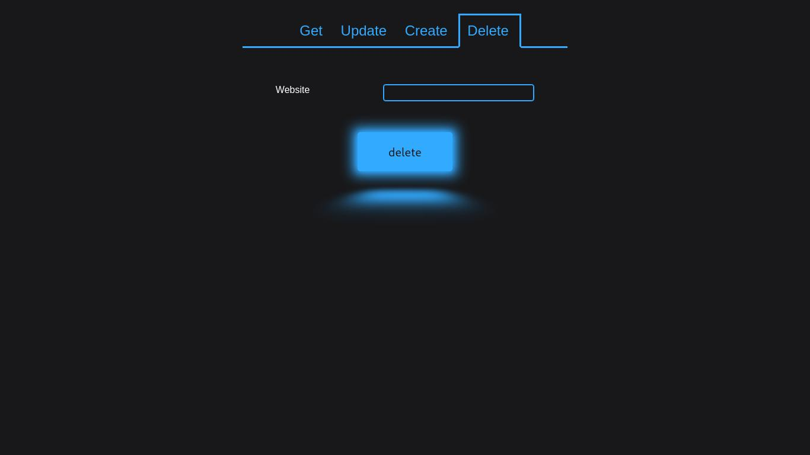
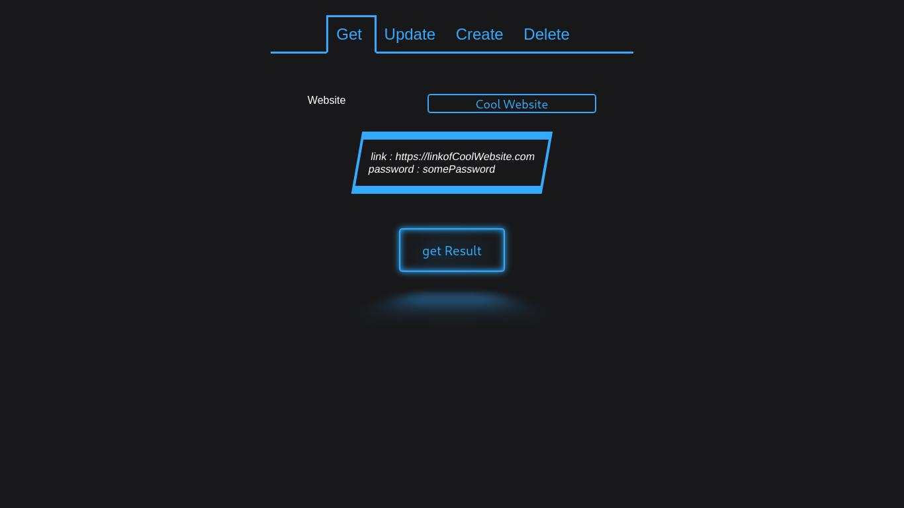

# WebsitePasswordManager
A web application for managing passwords of various websites. 
## installation:
1.  Make a .env file
2.  Copy contents from env_file_format.txt to .env
3.  Edit .env file to change ports number, database name, password etc.
4.  Execute 'docker-compose up --build' in terminal if you are running first time, every other time execute 'docker-compose up' only. 
5.  If there are errors in running the program, the before executing step 4 above, goto frontend folder and execute npm install, then go to backend folder and run npm install, then continue with step 4
## ScreenShots:

